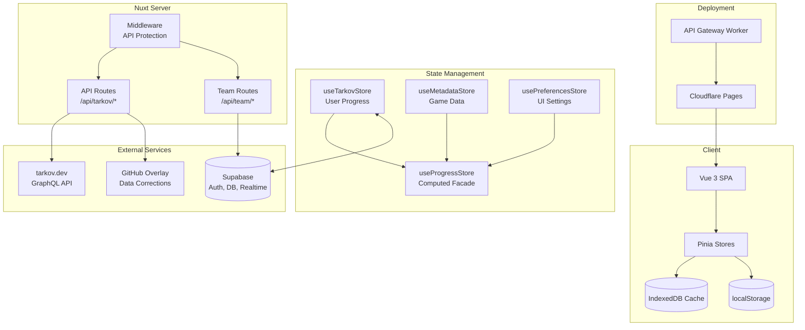
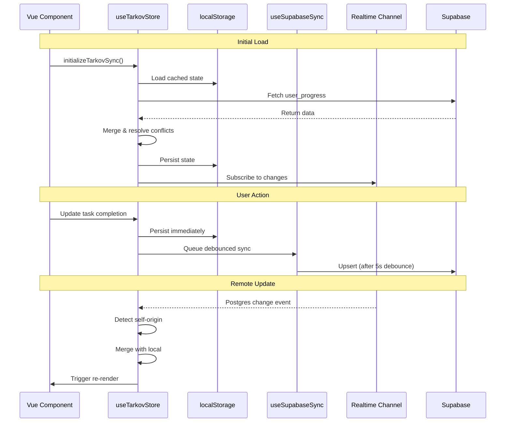
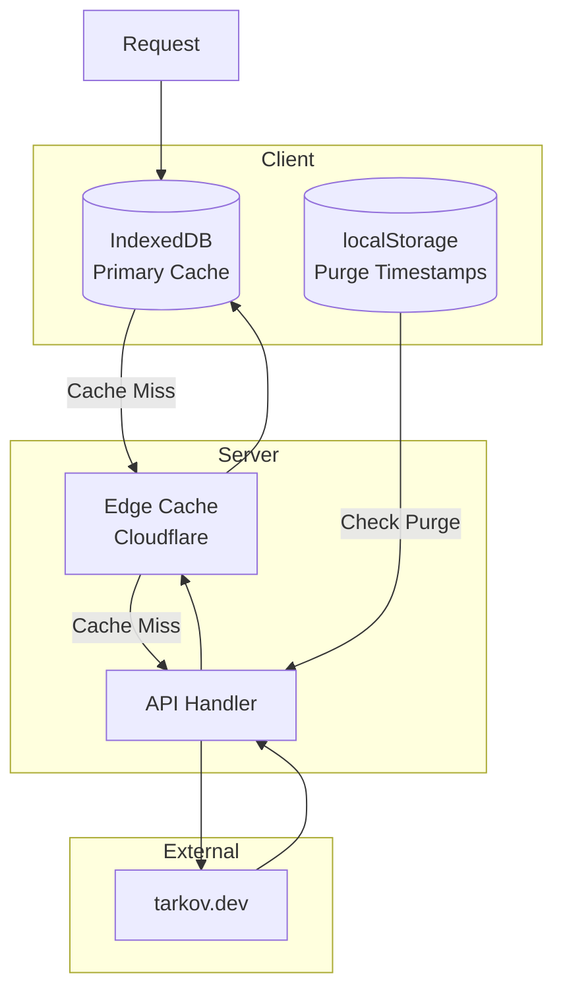

# TarkovTracker Architecture Documentation

## Overview

TarkovTracker is a sophisticated single-page application (SPA) for tracking progress in Escape from Tarkov. Built with Nuxt 4, Vue 3, and Supabase, it provides real-time multi-device synchronization, team collaboration, and comprehensive task/hideout tracking.

## Technology Stack

| Layer             | Technology       | Version |
| ----------------- | ---------------- | ------- |
| Framework         | Nuxt             | ^4.3.0  |
| UI Library        | Vue 3            | ^3.5.27 |
| Component Library | @nuxt/ui         | ^4.4.0  |
| Styling           | Tailwind CSS     | ^4.1.18 |
| State Management  | Pinia            | ^3.0.4  |
| Backend           | Supabase         | ^2.93.2 |
| Deployment        | Cloudflare Pages | -       |
| Maps              | Leaflet          | ^1.9.4  |
| Graphs            | Graphology       | ^0.26.0 |
| Visualization     | D3               | ^7.9.0  |
| i18n              | Vue I18n         | ^11.2.8 |

## Project Structure

```text
/
├── app/                      # Application source (Nuxt srcDir)
│   ├── assets/              # Static assets (CSS, images)
│   ├── components/          # Global UI components
│   ├── composables/         # Reusable composition functions
│   ├── data/                # Static data (maps.json)
│   ├── features/            # Feature modules (domain slices)
│   │   ├── admin/           # Admin dashboard
│   │   ├── dashboard/       # Main dashboard
│   │   ├── hideout/         # Hideout tracking
│   │   ├── maps/            # Interactive maps
│   │   ├── neededitems/     # Required items tracker
│   │   ├── settings/        # User settings
│   │   ├── tasks/           # Task/quest tracking
│   │   └── team/            # Team collaboration
│   ├── layouts/             # Page layouts
│   ├── locales/             # i18n translations (JSON5)
│   ├── pages/               # File-based routing
│   ├── plugins/             # Nuxt plugins
│   ├── server/              # Nitro server routes
│   │   ├── api/             # API endpoints
│   │   ├── middleware/      # Server middleware
│   │   └── utils/           # Server utilities
│   ├── shell/               # App chrome (nav, footer)
│   ├── stores/              # Pinia stores
│   ├── types/               # TypeScript definitions
│   └── utils/               # Utility functions
├── docs/                     # Documentation
├── supabase/                 # Supabase config and functions
├── workers/                  # Cloudflare Workers
│   └── api-gateway/         # Rate limiting gateway
├── nuxt.config.ts           # Nuxt configuration
├── package.json             # Dependencies
└── vitest.config.ts         # Test configuration
```

## Architecture Diagram



## State Management

### Three-Store Pattern + Facade

TarkovTracker uses a **three-store pattern** with Pinia plus a computed facade:

1. **useTarkovStore** - User progress (tasks, hideout, level)
2. **useMetadataStore** - Game data (tasks, items, maps)
3. **usePreferencesStore** - UI settings

**Facade:**

- **useProgressStore** - Computed properties combining all three stores

### Store Responsibilities

#### useTarkovStore (User Progress)

**Location:** `app/stores/useTarkov.ts`

Manages user progress data with dual game mode support (PvP/PvE).

**Key Features:**

- localStorage persistence with user ID validation
- Supabase real-time sync with debouncing (5s)
- Multi-device conflict resolution
- Data migration for legacy formats
- Task repair mechanisms

#### useMetadataStore (Game Data)

**Location:** `app/stores/useMetadata.ts`

Manages static game data from tarkov.dev API.

**Key Features:**

- Two-phase task loading (core → objectives → rewards)
- IndexedDB caching with TTL
- Graph building for task dependencies
- Item hydration for objectives
- Language-aware data fetching

#### useProgressStore (Computed Facade)

**Location:** `app/stores/useProgress.ts`

Provides computed properties combining all stores.

**Key Computed Properties:**

- `tasksCompletions` - Per-team task completion status
- `unlockedTasks` - Task availability considering prerequisites
- `hideoutLevels` - Current hideout progression
- `objectiveCompletions` - Task objective progress
- `invalidTasks` - Data consistency validation

## Data Synchronization

### Supabase Sync Flow



### Conflict Resolution Strategy

1. **Sticky Complete Semantics**: Once a task is marked complete, it stays complete unless explicitly set to false
2. **Timestamp-Based Merging**: Newer entries take precedence
3. **Max Value Preservation**: For counts and levels, keep the higher value
4. **Self-Origin Filtering**: Ignore echoed updates from own device (< 3s threshold)

## Authentication

### OAuth Popup Flow (Login)

- `pollTimer` runs every 500ms; if the popup closes, it clears `loading.value[provider]` and runs
  `cleanup()`, otherwise it sets `popupConfirmedOpen`.
- `fallbackTimer` runs at 3s; if `didCleanup` is false, loading is still active, the popup was never
  confirmed open, and the popup is missing or closed, it runs `cleanup()` and then
  `fallbackToRedirect(url, provider)`.
- `abandonedTimer` runs at 90s; if `didCleanup` is still false, it clears `loading.value[provider]` and
  runs `cleanup()` to abort the flow.
- `popupConfirmedOpen` tracks whether the popup has been detected as open at least once to avoid
  triggering the redirect fallback unnecessarily.
- `loading.value[provider]` acts as the gate for the fallback timer; if loading is cleared, fallback exits.
- `cleanup()` clears timers, removes the message listener, and attempts to close the popup safely.

## API Architecture

### Tarkov Data API

All game data is fetched through Nuxt server routes that proxy to tarkov.dev GraphQL API.

| Endpoint                       | Purpose              | Cache TTL |
| ------------------------------ | -------------------- | --------- |
| `/api/tarkov/bootstrap`        | Player levels        | 12h       |
| `/api/tarkov/tasks-core`       | Tasks, maps, traders | 12h       |
| `/api/tarkov/tasks-objectives` | Task objectives      | 12h       |
| `/api/tarkov/tasks-rewards`    | Task rewards         | 12h       |
| `/api/tarkov/hideout`          | Hideout stations     | 12h       |
| `/api/tarkov/items-lite`       | Items (minimal)      | 24h       |
| `/api/tarkov/items`            | Items (full)         | 24h       |
| `/api/tarkov/prestige`         | Prestige levels      | 24h       |
| `/api/tarkov/cache-meta`       | Cache purge status   | no-store  |

### Team API

| Endpoint            | Method | Purpose                    |
| ------------------- | ------ | -------------------------- |
| `/api/team/members` | GET    | Fetch team member profiles |

### Caching Strategy



## Security

### API Protection

```typescript
// nuxt.config.ts
runtimeConfig: {
  apiProtection: {
    allowedHosts: process.env.API_ALLOWED_HOSTS,
    trustedIpRanges: process.env.API_TRUSTED_IP_RANGES,
    requireAuth: process.env.API_REQUIRE_AUTH !== 'false',
    publicRoutes: '/api/tarkov/*',
    trustProxy: process.env.API_TRUST_PROXY === 'true',
  }
}
```

### Authentication Flow

1. User authenticates via Supabase (OAuth/email)
2. JWT stored in session
3. Protected routes validate token
4. Team API validates membership

## Performance Optimizations

1. **IndexedDB Caching**: Reduce network requests
2. **Idle Task Scheduling**: Defer non-critical fetches
3. **Graph Building**: O(1) task dependency lookups
4. **Memoization**: Cache computed values
5. **Virtual Scrolling**: Handle large lists
6. **Manual Chunks**: Separate vendor bundles

## Testing

**Framework:** Vitest + Vue Test Utils

```bash
# Run all tests
npx vitest run

# Watch mode (default)
npx vitest

# API Gateway tests
npm run test:api-gateway
```

**Test Organization:**

- Unit tests: `app/**/__tests__/*.test.ts`
- Mock strategy: Supabase client, network requests
- DOM environment: happy-dom

## Deployment

### Cloudflare Pages

```yaml
Build command: npm run build
Build output: dist
Root directory: /
Node.js version: 24.x
```

### Environment Variables

**Client-side (browser):**

| Variable                 | Description                            | Required |
| ------------------------ | -------------------------------------- | -------- |
| `VITE_SUPABASE_URL`      | Supabase project URL for auth and sync | Yes¹     |
| `VITE_SUPABASE_ANON_KEY` | Supabase anon key for auth and sync    | Yes¹     |

> **¹ Yes:** Required in production; optional for local development. Without `VITE_SUPABASE_URL` and `VITE_SUPABASE_ANON_KEY`, authentication, multi-device sync, real-time collaboration, and team features will be unavailable. The app will function in offline mode with localStorage persistence only.

**Server-side (Nuxt/Workers):**

| Variable                    | Description          | Required    |
| --------------------------- | -------------------- | ----------- |
| `SUPABASE_URL`              | Supabase project URL | Yes (prod)² |
| `SUPABASE_ANON_KEY`         | Supabase anon key    | Yes (prod)² |
| `SUPABASE_SERVICE_ROLE_KEY` | Service role key     | Yes (prod)² |
| `NUXT_PUBLIC_APP_URL`       | Application URL      | Yes (prod)² |
| `API_ALLOWED_HOSTS`         | Allowed origin hosts | No          |
| `API_TRUST_PROXY`           | Trust proxy headers  | No          |

> **² Yes (prod):** Required in production deployments; optional in local/dev where auth and sync will be disabled.

## Code Conventions

- **Indent:** 2 spaces
- **Line width:** 100 characters
- **Strings:** Single quotes
- **Semicolons:** Always
- **Imports:** Use `@/` alias
- **Components:** PascalCase
- **Colors:** Tailwind tokens only (no hex)
- **Comments:** Only where necessary
