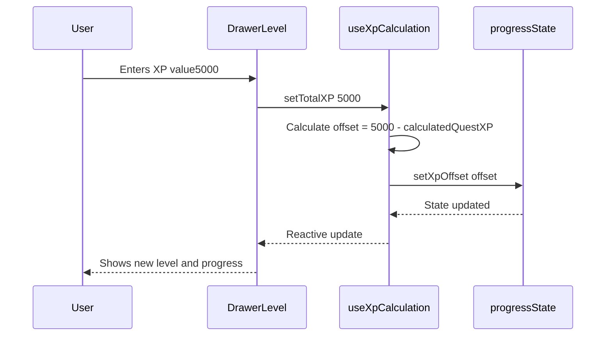
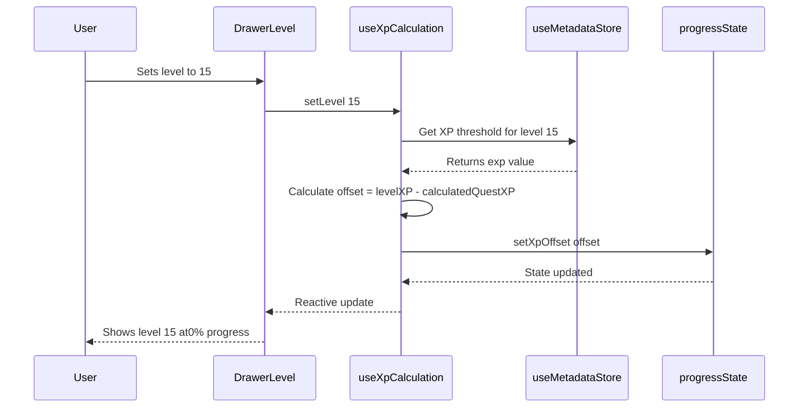
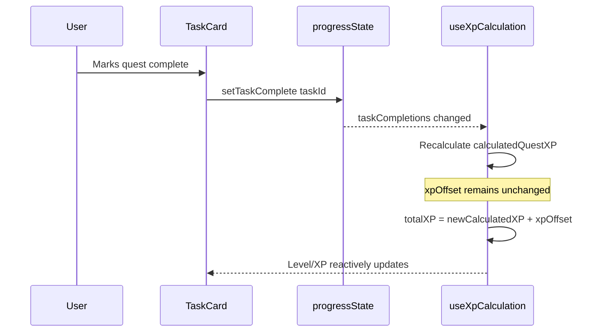
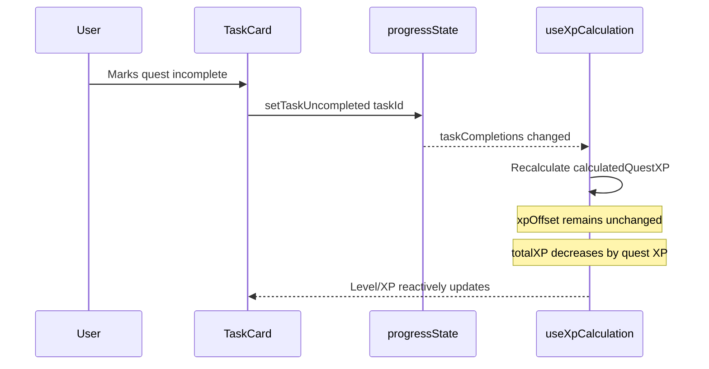

# XP/Level Calculation System Architecture

## 1. Overview

### Purpose

Dynamic XP calculation system with manual adjustment support for tracking player progression in Escape from Tarkov.

### Problem Statement

Users need to account for untracked XP sources that the tracker cannot automatically detect:

- Daily and weekly quests
- Combat kills (PMC, Scav, bosses)
- Survival XP bonuses
- Looting and exploration XP
- Skill-based XP gains

The current system only tracks the user's level as a manually-set integer, with no visibility into XP progress toward the next level.

### Solution: XP Offset Approach

Implement an **XP Offset** system that separates calculated quest XP from user adjustments. This approach:

- Automatically calculates XP from completed tracked tasks
- Allows users to manually set their actual XP/level
- Stores only the **difference** (offset) between calculated and actual XP
- Maintains accuracy as users complete more quests

---

## 2. Data Model

### New Field in `UserProgressData`

Location: [`app/stores/progressState.ts`](../app/stores/progressState.ts:43)

```typescript
export interface UserProgressData {
  level: number; // Existing: User's current level (legacy, kept for compatibility)
  pmcFaction: 'USEC' | 'BEAR';
  displayName: string | null;
  taskObjectives: { [objectiveId: string]: TaskObjective };
  taskCompletions: { [taskId: string]: TaskCompletion };
  hideoutParts: { [objectiveId: string]: HideoutPart };
  hideoutModules: { [hideoutId: string]: HideoutModule };
  traders: { [traderId: string]: TraderProgress };
  skills: { [skillName: string]: number };
  // NEW: XP offset for manual adjustment
  xpOffset: number; // Default: 0, can be negative or positive
}
```

### Computed Values (Not Stored)

These values are derived at runtime and should NOT be persisted:

| Value               | Description                                | Calculation                                                   |
| ------------------- | ------------------------------------------ | ------------------------------------------------------------- |
| `calculatedQuestXP` | Sum of XP from all completed tracked tasks | `Σ task.experience` for all completed tasks                   |
| `totalXP`           | User's actual total XP                     | `calculatedQuestXP + xpOffset`                                |
| `derivedLevel`      | Level determined from totalXP              | Highest level where `playerLevels[level].exp <= totalXP`      |
| `xpProgress`        | Progress percentage to next level          | `(totalXP - currentLevelXP) / (nextLevelXP - currentLevelXP)` |

### Default State Update

```typescript
const defaultProgressData: UserProgressData = {
  level: 1,
  pmcFaction: 'USEC',
  displayName: null,
  taskObjectives: {},
  taskCompletions: {},
  hideoutParts: {},
  hideoutModules: {},
  traders: {},
  skills: {},
  xpOffset: 0, // NEW: Default offset is 0
};
```

---

## 3. Key Formulas

### Core XP Calculations

```typescript
// Total XP calculation
totalXP = calculatedQuestXP + xpOffset;

// When user manually sets their XP
xpOffset = userSetXP - calculatedQuestXP;

// When user manually sets their level (convert level to XP first)
xpOffset = playerLevels[userSetLevel].exp - calculatedQuestXP;

// Derive level from total XP
derivedLevel = playerLevels.findLast((pl) => pl.exp <= totalXP)?.level ?? 1;

// XP progress to next level (0.0 to 1.0)
currentLevelXP = playerLevels[derivedLevel].exp;
nextLevelXP = playerLevels[derivedLevel + 1]?.exp ?? currentLevelXP;
xpProgress = (totalXP - currentLevelXP) / (nextLevelXP - currentLevelXP);
```

### Example Scenarios

**Scenario 1: Fresh Start**

```
calculatedQuestXP = 0
xpOffset = 0
totalXP = 0
derivedLevel = 1
```

**Scenario 2: User completes "Debut" quest (600 XP)**

```
calculatedQuestXP = 600
xpOffset = 0 (unchanged)
totalXP = 600
derivedLevel = 2(if threshold is met)
```

**Scenario 3: User manually sets XP to 5000 (has extra XP from kills)**

```
calculatedQuestXP = 600
xpOffset = 5000 - 600 = 4400
totalXP = 5000
derivedLevel = (calculated from playerLevels)
```

**Scenario 4: User completes another quest (800 XP)**

```
calculatedQuestXP = 600+ 800 = 1400
xpOffset = 4400 (unchanged)
totalXP = 1400 + 4400 = 5800
derivedLevel = (recalculated)
```

---

## 4. User Interaction Flows

### Flow 1: Setting XP Manually



### Flow 2: Setting Level Manually



### Flow 3: Completing a Quest



### Flow 4: Uncompleting a Quest



---

## 5. Implementation Components

### 5.1 Store Update: `app/stores/progressState.ts`

**Changes Required:**

- Add `xpOffset: number` to `UserProgressData` interface
- Add `xpOffset: 0` to `defaultProgressData`
- Add getter: `getXpOffset`
- Add action: `setXpOffset(offset: number)`
- Update migration function to handle existing users

```typescript
// New getter
getXpOffset: (state: UserState) => () => getCurrentData(state).xpOffset ?? 0,

// New action
setXpOffset(this: UserState, offset: number) {
  const currentData = getCurrentData(this);
  currentData.xpOffset = offset;
},
```

### 5.2 New Composable: `app/composables/useXpCalculation.ts`

**Purpose:** Centralize all XP calculation logic with reactive computed values.

```typescript
// app/composables/useXpCalculation.ts
import { computed } from 'vue';
import { useTarkovStore } from '@/stores/useTarkov';
import { useMetadataStore } from '@/stores/useMetadata';

export function useXpCalculation() {
  const tarkovStore = useTarkovStore();
  const metadataStore = useMetadataStore();

  // Calculate XP from completed tasks
  const calculatedQuestXP = computed(() => {
    let totalXP = 0;
    const completions = tarkovStore.getCurrentProgressData().taskCompletions;

    for (const taskId of Object.keys(completions)) {
      if (completions[taskId]?.complete && !completions[taskId]?.failed) {
        const task = metadataStore.getTaskById(taskId);
        if (task?.experience) {
          totalXP += task.experience;
        }
      }
    }
    return totalXP;
  });

  // Get stored offset
  const xpOffset = computed(() => tarkovStore.getXpOffset());

  // Total XP = calculated + offset
  const totalXP = computed(() => calculatedQuestXP.value + xpOffset.value);

  // Derive level from total XP
  const derivedLevel = computed(() => {
    const levels = metadataStore.playerLevels;
    if (!levels.length) return 1;

    let level = 1;
    for (const pl of levels) {
      if (pl.exp <= totalXP.value) {
        level = pl.level;
      } else {
        break;
      }
    }
    return level;
  });

  // XP thresholds for current and next level
  const currentLevelXP = computed(() => {
    const levels = metadataStore.playerLevels;
    const entry = levels.find((pl) => pl.level === derivedLevel.value);
    return entry?.exp ?? 0;
  });

  const nextLevelXP = computed(() => {
    const levels = metadataStore.playerLevels;
    const entry = levels.find((pl) => pl.level === derivedLevel.value + 1);
    return entry?.exp ?? currentLevelXP.value;
  });

  // Progress percentage (0 to 1)
  const xpProgress = computed(() => {
    const range = nextLevelXP.value - currentLevelXP.value;
    if (range <= 0) return 1; // Max level
    return (totalXP.value - currentLevelXP.value) / range;
  });

  // XP remaining to next level
  const xpToNextLevel = computed(() => {
    return Math.max(0, nextLevelXP.value - totalXP.value);
  });

  // Actions
  function setTotalXP(xp: number) {
    const offset = xp - calculatedQuestXP.value;
    tarkovStore.setXpOffset(offset);
  }

  function setLevel(level: number) {
    const levels = metadataStore.playerLevels;
    const entry = levels.find((pl) => pl.level === level);
    if (entry) {
      setTotalXP(entry.exp);
    }
  }

  function adjustXP(delta: number) {
    setTotalXP(totalXP.value + delta);
  }

  return {
    // Computed values
    calculatedQuestXP,
    xpOffset,
    totalXP,
    derivedLevel,
    currentLevelXP,
    nextLevelXP,
    xpProgress,
    xpToNextLevel,

    // Actions
    setTotalXP,
    setLevel,
    adjustXP,
  };
}
```

### 5.3 Enhanced Component: `app/features/drawer/DrawerLevel.vue`

**Changes Required:**

- Import and use `useXpCalculation` composable
- Add XP progress bar (optional, controlled by preference)
- Add XP display showing current/next level XP
- Update level editing to use `setLevel` from composable

**UI Enhancements:**

```vue
<!-- XP Progress Bar - shown when showXpProgress preference is true -->
<div v-if="showXpProgress" class="mt-2">
  <div class="flex justify-between text-xs text-gray-400mb-1">
    <span>{{ formatNumber(totalXP) }} XP</span>
    <span>{{ formatNumber(xpToNextLevel) }} to next</span>
  </div>
  <div class="h-1.5 bg-gray-700 rounded-full overflow-hidden">
    <div
      class="h-full bg-primary transition-all duration-300"
      :style="{ width: `${xpProgress * 100}%` }"
    />
  </div>
</div>
```

### 5.4 Optional Settings Component: `app/features/settings/XpSettingsCard.vue`

**Purpose:** Allow users to manually input their exact XP if they know it.

```vue
<template>
  <GenericCard title="XP Settings">
    <div class="space-y-4">
      <!-- Current XP Display -->
      <div class="flex items-center justify-between">
        <span>Calculated Quest XP:</span>
        <span class="font-mono">{{ formatNumber(calculatedQuestXP) }}</span>
      </div>
      <div class="flex items-center justify-between">
        <span>XP Offset:</span>
        <span class="font-mono" :class="xpOffset >= 0 ? 'text-green-400' : 'text-red-400'">
          {{ xpOffset >= 0 ? '+' : '' }}{{ formatNumber(xpOffset) }}
        </span>
      </div>
      <div class="flex items-center justify-between">
        <span>Total XP:</span>
        <span class="font-mono font-bold">{{ formatNumber(totalXP) }}</span>
      </div>

      <!-- Manual XP Input -->
      <div class="border-t border-gray-700 pt-4">
        <label class="mb-2 block text-sm">Set Total XP Manually:</label>
        <div class="flex gap-2">
          <input
            v-model.number="manualXP"
            type="number"
            class="flex-1 rounded bg-gray-800 px-3 py-2"
            :placeholder="totalXP.toString()"
          />
          <button @click="applyManualXP" class="btn-primary">Apply</button>
        </div>
      </div>

      <!-- Reset Offset -->
      <button @click="resetOffset" class="btn-secondary w-full">Reset XP Offset to 0</button>
    </div>
  </GenericCard>
</template>
```

### 5.5 Preferences Update: `app/stores/usePreferences.ts`

**New Preference:**

```typescript
interface PreferencesState {
  // ... existing preferences
  showXpProgress: boolean;  // NEW: Show XP progress bar in drawer
}

// Default value
showXpProgress: false,  // Off by default, opt-in feature

// Getter
getShowXpProgress: (state) => state.showXpProgress ?? false,

// Action
setShowXpProgress(show: boolean) {
  this.showXpProgress = show;
},

// Add to persist.pick array
'showXpProgress',
```

---

## 6. Edge Cases

### 6.1 Negative Offset

**Scenario:** User has fewer XP than calculated (e.g., they haven't actually completed all marked quests in-game).

**Handling:** This is a valid scenario. The system should:

- Allow negative offsets
- Display the correct derived level
- Show accurate progress bar

```typescript
// Example: User marked quests complete but hasn't done them in-game
calculatedQuestXP = 10000;
xpOffset = -5000; // User manually set XP to 5000
totalXP = 5000; // Correct actual XP
```

### 6.2 Game Mode Switching

**Scenario:** User switches between PvP and PvE modes.

**Handling:** Each game mode maintains its own separate `xpOffset`:

- PvP progress data has its own `xpOffset`
- PvE progress data has its own `xpOffset`
- Switching modes loads the appropriate offset

```typescript
// In UserState
pvp: {
  // ... other fields
  xpOffset: 1500,  // PvP offset
}
pve: {
  // ... other fields
  xpOffset: -200,  // PvE offset (different progression)
}
```

### 6.3 Migration for Existing Users

**Scenario:** Existing users have progress data without `xpOffset` field.

**Handling:** Migration function in [`progressState.ts`](../app/stores/progressState.ts:78):

```typescript
export function migrateToGameModeStructure(legacyData: unknown): UserState {
  // ... existing migration logic

  // Ensure xpOffset exists with default value
  const ensureXpOffset = (data: UserProgressData): UserProgressData => ({
    ...data,
    xpOffset: data.xpOffset ?? 0,
  });

  return {
    currentGameMode: /* ... */,
    gameEdition: /* ... */,
    pvp: ensureXpOffset(pvpData),
    pve: ensureXpOffset(pveData),
  };
}
```

### 6.4 Max Level Reached

**Scenario:** User reaches maximum level (currently 79).

**Handling:**

- `xpProgress` returns 1.0 (100%)
- `xpToNextLevel` returns 0
- Progress bar shows full
- Level cannot exceed max

### 6.5 Task Data Not Loaded

**Scenario:** XP calculation runs before task metadata is loaded.

**Handling:**

- `calculatedQuestXP` returns 0 if no tasks loaded
- `totalXP` equals `xpOffset` only
- UI shows loading state or gracefully handles missing data

### 6.6 Supabase Sync

**Scenario:** `xpOffset` needs to sync to Supabase.

**Handling:** The existing sync mechanism in [`useTarkov.ts`](../app/stores/useTarkov.ts:416) already syncs the entire `pvp_data` and `pve_data` objects, which will include `xpOffset` automatically.

---

## 7. API Data Dependencies

### Task Experience Data

**Source:** [`tasks[].experience`](../app/types/tarkov.ts:135)

```typescript
interface Task {
  id: string;
  experience?: number; // XP reward for completing this task
  // ... other fields
}
```

**Access:** Via `useMetadataStore().tasks` or `useMetadataStore().getTaskById(taskId)`

### Player Level Thresholds

**Source:** [`playerLevels[].exp`](../app/types/tarkov.ts:177)

```typescript
interface PlayerLevel {
  level: number; // Level number (1-79)
  exp: number; // Cumulative XP required to reach this level
  levelBadgeImageLink: string;
}
```

**Access:** Via `useMetadataStore().playerLevels`

**Example Data:**

```json
[
  { "level": 1, "exp": 0 },
  { "level": 2, "exp": 1000 },
  { "level": 3, "exp": 4017 },
  { "level": 4, "exp": 8432 }
  // ... continues to level 79
]
```

### Data Flow Diagram

```mermaid
flowchart TD
    subgraph API Data
        A[tarkov.dev API]B[tasks with experience]
        C[playerLevels with exp thresholds]
    end

    subgraph Stores
        D[useMetadataStore]
        E[useTarkovStore]
        F[taskCompletions]
        G[xpOffset]
    end

    subgraph Composable
        H[useXpCalculation]
        I[calculatedQuestXP]
        J[totalXP]
        K[derivedLevel]
    end

    subgraph UI
        L[DrawerLevel]
        M[XpSettingsCard]
    end

    A --> B
    A --> C
    B --> D
    C --> D
    D --> H
    E --> F
    E --> G
    F --> I
    G --> J
    I --> J
    J --> K
    D --> K
    H --> L
    H --> M
```

---

## 8. Testing Strategy

### Unit Tests for `useXpCalculation`

```typescript
// app/composables/__tests__/useXpCalculation.test.ts

describe('useXpCalculation', () => {
  it('calculates quest XP from completed tasks', () => {
    // Setup: Mock completed tasks with known XP values
    // Assert: calculatedQuestXP equals sum of task XP
  });

  it('applies offset correctly to total XP', () => {
    // Setup: Set xpOffset to 1000
    // Assert: totalXP = calculatedQuestXP + 1000
  });

  it('derives correct level from total XP', () => {
    // Setup: Set totalXP to known threshold
    // Assert: derivedLevel matches expected level
  });

  it('handles negative offset', () => {
    // Setup: Set negative xpOffset
    // Assert: totalXP is reduced, level is lower
  });

  it('calculates progress percentage correctly', () => {
    // Setup: Set XP midway between two levels
    // Assert: xpProgress is approximately 0.5
  });

  it('handles max level gracefully', () => {
    // Setup: Set XP beyond max level threshold
    // Assert: derivedLevel is max, xpProgress is 1
  });
});
```

### Integration Tests

```typescript
describe('XP System Integration', () => {
  it('updates XP when quest is completed', () => {
    // Complete a quest
    // Assert: totalXP increases by quest XP// Assert: offset remains unchanged
  });

  it('maintains offset when quest is uncompleted', () => {
    // Set manual XP, then uncomplete a quest
    // Assert: offset unchanged, totalXP decreases
  });

  it('persists offset across page reload', () => {
    // Set offset, reload page
    // Assert: offset is restored from localStorage/Supabase
  });
});
```
