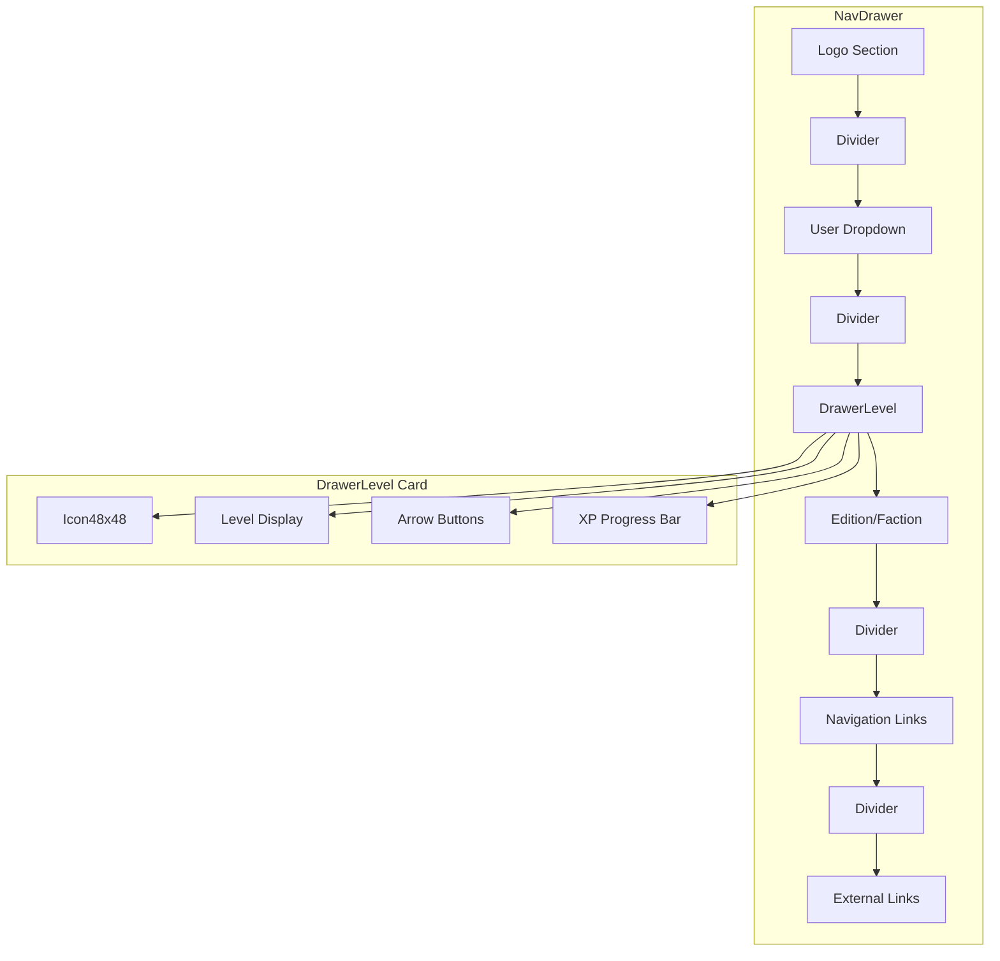

# 1080p Layout Fixes Plan

## Problem Summary

Users on 1080p monitors (1920x1080) are experiencing layout issues:

1. **Sidebar scrollbar appears** - The navigation drawer content exceeds viewport height
2. **Level selector arrows overflow** - The up/down arrows for changing level shift outside bounds
3. **General cramped appearance** - Various elements look "weird" compared to 2K displays

## Root Cause Analysis

### Issue 1: Sidebar Scrollbar

**File:** [`app/shell/NavDrawer.vue`](app/shell/NavDrawer.vue:20)

The sidebar inner container uses `overflow-y-auto` which shows a scrollbar when content exceeds height.

**Content height breakdown (expanded state):**

- Logo + site name: ~100px
- Divider: ~8px
- User dropdown: ~56px
- Divider: ~8px
- DrawerLevel card: ~130px
- Edition/Faction buttons: ~90px
- Divider: ~8px
- Navigation links (7 items × 44px): ~308px
- Divider: ~8px
- External header: ~32px
- External links (4 items × 44px): ~176px
- **Total: ~924px**

On 1080p with browser chrome, usable viewport height is typically900-950px, causing overflow.

### Issue 2: Level Selector Overflow

**File:** [`app/features/drawer/DrawerLevel.vue`](app/features/drawer/DrawerLevel.vue:15-78)

The level selector card at line 15 lacks `overflow-hidden`, and the flex container at line 16 doesn't properly constrain children. The arrow buttons container (line 59) can overflow when:

- Sidebar is at 224px width (w-56)
- Content padding reduces available space to ~194px
- Icon (56px) + level display (~50px) + arrows (24px) + gaps = ~140px minimum

The issue occurs when font scaling or browser zoom affects the `em`-based widths.

## Proposed Solutions

### Solution 1: Optimize Sidebar Vertical Space

**Changes to [`app/shell/NavDrawer.vue`](app/shell/NavDrawer.vue):**

1. **Reduce logo section padding** (line 22-39):
   - Change `mt-2` to `mt-1`
   - Change `py-2` to `py-1.5`

2. **Reduce divider margins** (lines 40, 81, 106, 108):
   - Change `my-1` to `my-0.5` for dividers

3. **Reduce edition/faction section padding** (line 83):
   - Change `my-4` to `my-2`
   - Change `gap-2` to `gap-1.5`

4. **Add custom scrollbar styling** to hide scrollbar but keep functionality:
   - Add `scrollbar-thin scrollbar-track-transparent scrollbar-thumb-primary-800/50` classes
   - Or use CSS to hide scrollbar: `scrollbar-width: none` /`::-webkit-scrollbar { display: none }`

### Solution 2: Fix Level Selector Bounds

**Changes to [`app/features/drawer/DrawerLevel.vue`](app/features/drawer/DrawerLevel.vue):**

1. **Add overflow-hidden to card container** (line 15):

   ```html
   <div class="w-full overflow-hidden rounded-lg border ..."></div>
   ```

2. **Add min-w-0 to flex children** (line 16):

   ```html
   <div class="flex min-w-0 items-center gap-1"></div>
   ```

3. **Constrain icon container** (line 17-31):
   - Add `shrink-0` to prevent icon from shrinking
   - Reduce icon size from `h-14w-14` to `h-12 w-12`

4. **Fix level display width** (line 33-58):
   - Change `w-[2.2em]` to a fixed pixel width like `w-10` or `w-11`
   - Add `shrink-0` to prevent shrinking

5. **Constrain arrow buttons** (line 59-78):
   - Add `shrink-0` to the arrow container
   - Ensure buttons don't overflow

### Solution 3: Reduce DrawerLevel Card Height

**Additional changes to [`app/features/drawer/DrawerLevel.vue`](app/features/drawer/DrawerLevel.vue):**

1. **Reduce card padding** (line 15):
   - Change `px-2.5 py-2` to `px-2 py-1.5`

2. **Reduce XP progress section margin** (line 81):
   - Change `mt-2` to `mt-1.5`

3. **Reduce icon size** (lines 18-31):
   - Change `h-14 w-14` to `h-12 w-12`
   - Update `max-w-[56px]` to `max-w-[48px]`

## Implementation Order

1. Fix [`DrawerLevel.vue`](app/features/drawer/DrawerLevel.vue) overflow issues first
2. Reduce vertical spacing in [`DrawerLevel.vue`](app/features/drawer/DrawerLevel.vue)
3. Reduce vertical spacing in [`NavDrawer.vue`](app/shell/NavDrawer.vue)
4. Add scrollbar hiding/styling to [`NavDrawer.vue`](app/shell/NavDrawer.vue)
5. Test on both 1080p and 2K to verify no regressions

## Testing Checklist

- [ ] Sidebar fits without scrollbar on 1080p (1920x1080)
- [ ] Level selector arrows stay within bounds
- [ ] Level number is clickable and editable
- [ ] Up/down arrows function correctly
- [ ] XP progress bar displays correctly
- [ ] Layout looks good on 2K (2560x1440)
- [ ] Mobile/tablet responsive behavior unchanged
- [ ] Collapsed rail mode still works correctly

## Risk Assessment

**Low Risk:**

- Padding/margin reductions are minor visual changes
- Adding `overflow-hidden` is standard practice
- Adding `shrink-0` prevents unwanted flex shrinking

**Medium Risk:**

- Changing `em`-based widths to `px` may affect font scaling accessibility
- Hiding scrollbar may confuse users who expect to scroll

**Mitigation:**

- Use `rem` instead of `px` for better accessibility
- Keep `overflow-y-auto` so scrolling still works, just hide the visual scrollbar
- Test with browser zoom levels (100%, 125%, 150%)

## Mermaid Diagram: Component Layout


